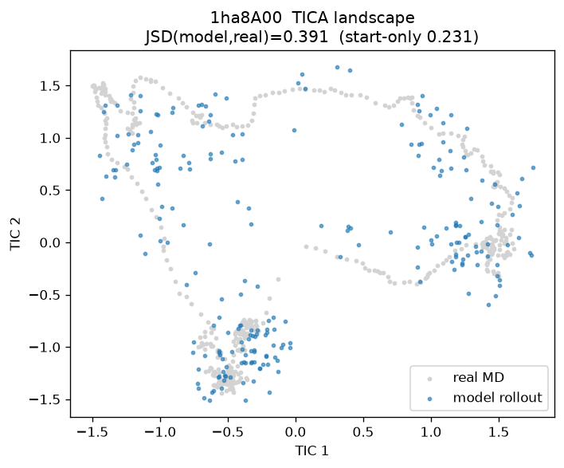
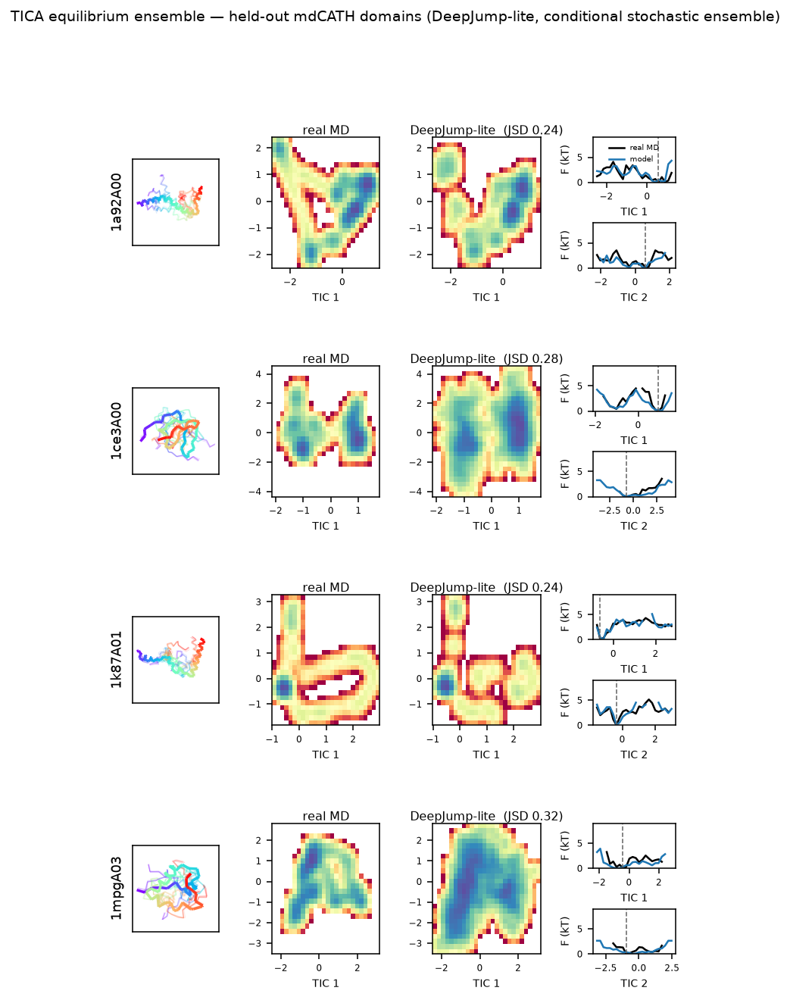

# DeepJump-lite — Reproduction Report

*A from-scratch, plain-PyTorch reproduction of the core trainable interface of
**DeepJump** (Costa et al. 2025, arXiv:2509.13294), run entirely on an Apple-Silicon
laptop (MPS). Rebuilds the method, data pipeline, equivariant model, and an honest
evaluation — with clearly marked boundaries and honest negative results.*

---

## 0. TL;DR

- **Goal reproduced:** the conditional conformational **jump operator**
  `p(X_{t+δ} | X_t, sequence, δ)` — predict a protein's conformation δ ns ahead in one shot,
  trained on the public **mdCATH** MD dataset.
- **Built:** `(P,V)` representation · Kabsch-aligned state-pair dataloader · hand-rolled
  SE(3)-equivariant two-stage transformer (GVP/EGNN-style, **no e3nn**) · AlphaFlow x₁-prediction
  generative framework · pairwise-vector / heavy-atom / 25 Å all-atom losses · ODE + mean sampling ·
  multi-step rollout · **TICA distributional evaluation** · 14/14 equivariance/masking/shape tests.
- **The model clearly learns the transport field** (single-step CA RMSD falls monotonically
  1.65 → 0.16 Å as the interpolant approaches the target; H=128).
- **Two research cruxes reproduced honestly:** (1) naive rollout is **unstable** — fixed
  progressively by a geometry gate, input-augmentation, and k-step unrolled training;
  (2) distributional fidelity is a **scale problem** — TICA JSD closes 0.564 → 0.347 (floor 0.287)
  as we scale H=32 → 128 and 30 → 200 domains.
- **Out of reach (data/scale, not code):** the paper's fast-folder headline results
  (WW/NTL9/Lambda folding, stationary ΔG, MFPT) need DESRES trajectories and a stable ×10⁵-step
  rollout we do not have.


---

## 1. Background — what DeepJump does and why

Classical MD integrates femtosecond steps; reaching biologically meaningful conformational
change costs 10⁸–10¹² steps. DeepJump replaces the integrator with a **learned stochastic jump**:
instead of stepping, directly sample

```
    X_{t+δ}  ~  p( · | X_t, sequence, δ)
```

for a large δ (1–100 ns), amortizing thousands of MD steps into one network evaluation. The model
must therefore (a) represent a protein conformation as an SE(3)-equivariant tensor, (b) be a
**generative** model of a distribution (not a point regressor), and (c) remain stable when its own
outputs are fed back in for a long rollout. The three sections below map onto these three problems.

---

## 2. Methods

### 2.1 Representation `X = (P, V)` — `representation.py`

Each of the `N` residues is encoded as (Ophiuchus convention):

| tensor | shape | meaning | symmetry |
|---|---|---|---|
| `P` | `[N,3]` | Cα global coordinate | l=1 vector (`P → PRᵀ`) |
| `V` | `[N,13,3]` | heavy-atom offsets from Cα, canonical slot order, zero-padded | l=1 vector (`V → VRᵀ`) |
| `atom_mask` | `[N,13]` | 1 where a real heavy atom exists | invariant |

Keeping both `P` and `V` as **l=1 vectors** makes the representation **SE(3)-equivariant by
construction**: a global rotation `R` acts as `P→PRᵀ, V→VRᵀ` and leaves the mask and slot
assignment unchanged. The atom→(residue, slot) topology is fixed across a trajectory, so
`build_layout()` precomputes an integer index table **once per domain** and `apply_layout()`
gathers `(P,V)` cheaply for any batch of frames.

**Symmetric-sidechain canonicalization** (`canonicalize_symmetric`): the two symmetric atoms of
ASP/GLU/PHE/TYR/ARG are ordered by a rotation/translation-invariant key (distance to backbone N),
removing arbitrary-labelling noise.

### 2.2 Data pipeline — `data/mdcath.py`

mdCATH HDF5 layout: `domain → temperature{320,348,379,413,450} → replica{0..4} → coords[F,A,3]`
(Å, **1 frame = 1 ns**). Two gotchas, both handled:

1. **Atom names are not a per-atom array** — they live only in the embedded CHARMM PSF string
   (a full solvated system). `parse_protein_atom_names()` filters the PSF NATOM section to protein
   resnames, recovering exactly `numProteinAtoms` names in coords order.
2. **Rigid-body tumbling dominates raw displacement** — frame-to-frame Cα motion is ~10 Å, mostly
   global rotation. `MdcathPairDataset` **Kabsch-aligns** each future frame `X_{t+δ}` onto `X_t`
   (`kabsch_align_futures`, SVD-based optimal rotation) and centers both at the origin, leaving the
   ~1.3 Å **internal** conformational change — the only signal a conditioned model can predict.

The dataset yields aligned pairs `(X_t, X_{t+δ})` (or K-step futures for unrolled training),
supports **multi-scale δ** (`delta_frames: [1,10,100]`, one model over all jump sizes), random
residue cropping, and `collate_pairs()` pads variable-length proteins with a `residue_mask`.

### 2.3 Generative framework — AlphaFlow x₁-prediction (`model/deepjump.py`)

A deliberately simplified stochastic interpolant (EquiJump's two-sided SDE reduced to a plain ODE
that learns only `x̂₁`):

```
X⁰   = X_t + σ·ε                      # noised current frame  (σ = noise_sigma)
Xᵗᵃᵘ = (1−τ)·X⁰ + τ·X_{t+δ}          # linear interpolant, τ ~ U(0,1)
network predicts   X̂₁ ≈ X_{t+δ}
sampling ODE drift   b = (X̂₁ − Xᵗᵃᵘ)/(1−τ),  integrated τ: 0 → 1
```

At training time a random progress `τ` is sampled; the net sees `Xᵗᵃᵘ` and predicts the endpoint.
The noise on `X⁰` is what makes the model a distribution: one `X_t` maps to many samples.

### 2.4 Equivariant architecture — `model/layers.py`, `conditioner.py`, `transport.py`

State is a scalar/vector pair: `s ∈ [B,N,H]` (l=0, **invariant**) and `vec ∈ [B,N,C,3]`
(l=1, **equivariant**). Equivariance recipe: scalars derive from vectors only via norms; vectors are
only ever scaled by invariant scalars or channel-mixed (no bias on xyz). Building blocks:

- **`EquivLinear`** — no-bias channel mix over vector features `[B,N,Cin,3]→[B,N,Cout,3]`.
- **`ScalarVectorLayerNorm`** — LayerNorm on scalars, RMS-norm on vector magnitudes.
- **`GVP`** — geometric vector perceptron: vector norms feed the scalar MLP; a scalar-derived
  sigmoid gate modulates the vector output (the feed-forward block).
- **`EquivAttention`** — multi-head self-attention whose **logits are invariant**
  (`q·k` + learned sequence-offset bias + **Gaussian RBF of Cα–Cα distance**); the invariant softmax
  aggregates invariant scalar values, equivariant vector values, and relative-direction unit vectors.
- **`EquivBlock`** = pre-norm attention + GVP feed-forward, each residual.

Two stages share these blocks (6 layers each):

- **Conditioner** `(X_t, sequence, δ) → H_t = (s_ctx, vec_ctx)`. Independent of τ, so it is
  computed **once** and reused across all ODE steps.
- **Transport** `(Xᵗᵃᵘ, τ, H_t) → X̂₁`, with **residual output**:
  `P̂₁ = P_t + head(vec)`, `V̂₁ = V_t + head_v(vec)` (heavy atoms when `predict_heavy`). Since dP, dV
  are l=1 and P_t, V_t are l=1, the prediction is SE(3)-equivariant; the residual form suits the
  small aligned jump.

### 2.5 Losses — `losses.py`

- **Pairwise-vector Huber (Ophiuchus Vector-Map)** — Huber loss on the **3D difference vectors**
  `Pᵢ − Pⱼ` between residue pairs (not scalar distances): equivariant, translation-invariant,
  residue-masked. Primary Cα objective.
- **Heavy-atom offset Huber** — direct supervision on `V̂₁` (already Cα-relative), atom-masked.
- **25 Å all-atom Vector-Map** — reconstruct all-atom coords from `(P,V)`, Huber on every atom-pair
  difference vector within a 25 Å ground-truth cutoff (the paper's faithful loss).
- **k-step unrolled term** — supervise `f(f(…f(X_t)))≈X_{t+kδ}`, feeding detached previous
  predictions as inputs (rollout-robustness; see §4.6).

### 2.6 Training & sampling

Adam, grad-clip, τ~U(0,1) per step, honest val at **τ=0 with no noise** (random-τ eval leaks the
answer). `sample()` offers `mode="ode"` (Euler integrate 0→1) and `mode="mean"` (one-shot τ=0
conditional mean). `sampling.rollout()` chains jumps along a trajectory with an optional geometry
acceptance gate.

**Model sizes** (predict_heavy, 6+6 layers): H=32 → **114k** params · H=64 → **428k** · H=128 → **1.66M**.

---

## 3. Correctness gate

Equivariant nets fail silently — a broken symmetry still trains. The suite (**14/14 pass**) is the
guardrail:

- **Rotation equivariance** of the representation *and* of the full model, covering both `P̂₁` and
  `V̂₁` (`test_representation.py`, `test_model_equivariance.py`).
- **Masking / padding invariance** — padded residues cannot affect real outputs (`test_masking.py`).
- **Shapes** across configs (`test_shapes.py`).
- **fast-dev overfit** — a single batch, no noise: loss collapses **6.1 → 0.003**, confirming the
  net has the capacity to fit the transport field.

---

## 4. Experiments & results (held-out val domains)

### 4.1 Single-step transport field — CA RMSD vs latent time τ (Å)

| query | δ=1, H=32 | δ=1 +heavy | δ=10, H=32 | **δ=1, H=128** |
|---|---|---|---|---|
| no-op (`X̂=X_t`) | 1.58 | 1.58 | 2.25 | 1.58 |
| x̂₁ @ τ=0 | 1.65 | 1.67 | 2.28 | 1.58 |
| x̂₁ @ τ=0.25 | 0.70 | — | — | — |
| x̂₁ @ τ=0.5 | 0.52 | 0.54 | 0.64 | — |
| x̂₁ @ τ=0.9 | 0.42 | 0.42 | 0.53 | **0.16** |
| ODE sample (20 steps) | 1.87 | 2.44 | 2.68 | 1.84 (H=64) |

Accuracy improves **monotonically** as the interpolant input approaches the target → the model has
learned the field. Heavy-atom offset MAE follows the same curve (no-op 0.43 → τ=0.9 0.15 Å) and
adding the offset target does not hurt Cα.

### 4.2 Jump size δ=1 vs δ=10 ns

Error is uniformly higher at δ=10 (no-op 1.58→2.25) but the τ-curve shape is identical. **10× the
elapsed time moves the structure only ~1.4× as far** — protein motion is bounded / sub-diffusive,
which is exactly why learning large-δ jumps buys real MD acceleration.

### 4.3 Capacity & loss

H=64 beats H=32 at **every** τ (τ=0 1.67→1.58 = matches no-op, τ=0.9 0.42→0.35, ODE 2.44→1.84);
H=128 pushes τ=0.9 to **0.16**. The faithful **25 Å all-atom Vector-Map loss** trains cleanly and
modestly beats Cα+offset (ODE 2.44→1.96).

### 4.4 Rollout stability — the first research crux


Real dynamics drift only ~2 Å over 10 ns; naive rollout instead compounds error off-distribution.

| approach (mean mode) | ungated stable horizon | step-20 CA RMSD (Å) | step-20 bond (Å) |
|---|---|---|---|
| baseline ODE | 0 (explodes) | 8495 | 11604 |
| baseline mean | ~7 steps | 18.8 | 19.4 |
| input-augmentation | ~15 steps | 62 | 35 |
| 2-step unroll | ~13 steps | 70 | 90 |
| **3-step unroll** | **~20 steps** | **6.4** | **4.5** |
| **3-step unroll + gate** | **20+ (stable)** | **2.9** | **3.9** (FNC 0.81) |

Three fixes, increasingly principled: **(a) geometry acceptance gate** (Timewarp spirit) bounds the
rollout but at low acceptance — stable-but-conservative; **(b) input-augmentation** noises the
conditioner's `X_t` so the model recovers from imperfect inputs (and single-step even *improves*);
**(c) k-step unrolled / self-conditioning** training is the real horizon cure — each extra unroll
step extends stability, 3-step keeps the *ungated* rollout physical over the full 20 steps.

### 4.5 Distributional fidelity (TICA) — the second research crux

The correct metric is distributional, not single-step. `tica_eval.py` fits TICA on a real
trajectory's SE(3)-invariant Cα-pairwise features, projects a model ensemble and real MD into TIC
space, and compares via 2D-histogram JSD. The **DeepJump-native ensemble** is `--gen conditional`:
K stochastic ODE single-jumps per start frame (different τ=0 noise) — geometrically stable, so it
populates `p(X_{t+δ}|X_t)` correctly (a deterministic mean discards that diversity).

**Scale ladder (same held-out domain, conditional ensemble):**

| model | conditional-ensemble TICA JSD (↓) |
|---|---|
| H=32, 30 dom, δ=1 (mean rollout) | 0.564 |
| H=64, 30 dom, δ=1 (stochastic ensemble) | 0.416 |
| H=128, 80 dom, multi-δ (stochastic ensemble) | 0.39 |
| **H=128, 200 dom, multi-δ (`faithful_scaled_v2`)** | **0.347** |
| no-dynamics floor (start-only) | 0.287 |

Monotonic: **~78 % of the gap to the floor closed** by scale + stochastic sampling alone (no
architecture change). The failure mode shifts from *under-explore / collapse to one corner* to
*roughly-right-shape but slightly over-dispersed density*. Caveat: **more steps ≠ better on small
data** — the same config at 60k steps (vs 40k) *regresses* to 0.545 (overfitting); the bottleneck is
now data **diversity** (more domains), not training **time**.



### 4.6 Paper-style TICA panel figure — `scripts/tica_panel.py`



Reproduces the *layout* of the paper's equilibrium-ensemble figure: per held-out domain, one row of
**[ Cα structure overlay | real-MD free energy | model free energy | TIC1/TIC2 marginals ]**, with
`F = -ln p` (kT), shared TIC binning so the two heatmaps are directly comparable, and marginals
plotting real (black) vs model (blue) with the native basin dashed. On held-out mdCATH domains the
H=128 model **traces the same free-energy basins as real MD** (JSD 0.24–0.32; model wells slightly
over-dispersed). This is the paper's *figure grammar* on **our** data — not the DESRES fast folders,
and no folding (see §6).

---

## 5. Honest findings

1. **The model learns the transport field** — monotonic τ-curve (1.65 → 0.16 Å, H=128).
2. **Single-step ≈ no-op at τ=0 is expected, not failure.** A deterministic x₁-MSE predictor
   approximates the conditional mean `E[X_{t+δ}|X_t] ≈ X_t` for diffusive 1 ns dynamics. Single-step
   RMSD vs no-op is a **weak** signal; DeepJump is judged distributionally.
3. **Naive rollout is unstable; three fixes help** (§4.4). Deeper unrolling is the real horizon cure;
   +gate holds it fully bounded — but even the stable rollout under-explores distributionally.
4. **Distributional fidelity is largely a scale problem** (§4.5): JSD 0.564 → 0.347 (floor 0.287) as
   H and domain-count grow — the paper's recipe (bigger H, more domains) rather than architecture.
   We are still at ~8 % of the paper's training budget.
5. **Larger δ = bigger, harder jump**, but sub-linear displacement — the basis of MD acceleration.
6. **Faithful components all train cleanly** (25 Å all-atom loss, multi-scale δ, symmetric-sidechain
   canonicalization, H-scaling) — drop-in steps toward the full method.

---

## 6. Differences from the DeepJump paper / out of scope

| axis | paper | this repro |
|---|---|---|
| generative model | SDE / two-sided stochastic interpolant (EquiJump) | ODE, x₁-prediction (AlphaFlow) — simplified |
| equivariance | e3nn spherical-harmonic tensor products (up to l=2) | hand-rolled GVP/EGNN (l=1), MPS-friendly |
| scale | H≤128, **5398** domains, 4×A6000, **500k** steps | H≤128, **≤200** domains, MPS laptop, ≤60k steps |
| loss | 25 Å all-atom Vector-Map | Cα-pairwise + heavy-offset (+ optional 25 Å all-atom) |
| eval data | DESRES fast folders (WW, NTL9, Lambda, …) | held-out **mdCATH** domains only |

**Genuinely out of reach here (data/stability, not a coding gap):** the fast-folder headline numbers
— stationary-ensemble JSD, folding ΔG, MFPT, ab-initio folding — need the DESRES trajectories (we do
not have them) *and* a stable ×10⁵-step rollout (we reach ~20). These are the project's research
frontier, not a missing script: we already produce every plot type they use (TICA landscapes,
RMSD/FNC time series, structure overlays) in miniature.

---

## 7. Limitations & next steps

- **Close the distributional gap** (main open item): continued scale toward the paper's regime;
  and/or deeper unrolling, energy-based MH acceptance, or an SDE / two-sided interpolant (EquiJump).
- **l=2 symmetric-sidechain encoding** (needs e3nn or a hand-rolled l=2 path).
- **δ=100 ns**, **MSM kinetics / fast-folder metrics** (need DESRES data).

---

## 8. Reproduce

```bash
pip install -e .
python scripts/download_mdcath.py --n 30 --max-gb 0.55            # or --n 200 for the scaled runs

# train
python scripts/train.py --config configs/ca_delta1.yaml          # Cα, δ=1 ns, H=32
python scripts/train.py --config configs/full_delta1.yaml        # + heavy-atom offsets
python scripts/train.py --config configs/full_delta1_unroll3.yaml # 3-step self-conditioning (stable rollout)
python scripts/train.py --config configs/faithful_scaled.yaml    # H=128, 80 dom, multi-δ (long MPS run)

# evaluate
python scripts/diagnose_tau.py --ckpt runs/ca_delta1/last.ckpt                 # τ-sweep vs no-op
python scripts/rollout_eval.py --ckpt runs/full_delta1_unroll3/last.ckpt --mode mean --gate
python scripts/tica_eval.py    --ckpt runs/faithful_scaled/last.ckpt           # TICA JSD
python scripts/tica_panel.py   --ckpt runs/faithful_scaled/last.ckpt --n 4     # docs/tica_panel.png
python scripts/plot_summary.py && python scripts/plot_stability.py             # docs/*.png

pytest -q                                                                      # 14/14
```

## Appendix — repository map

```
src/deepjump/
  atom_constants.py     canonical heavy-atom ordering, symmetric slots
  representation.py     (P,V) build, layout, Kabsch alignment, symmetric canonicalization
  data/mdcath.py        HDF5 reader + (X_t, X_{t+δ}) pair dataset (+ multi-δ, unroll, crop)
  model/                embeddings · layers (GVP/attention) · conditioner · transport · deepjump wrapper
  losses.py             pairwise-vector / heavy-offset / 25 Å all-atom Huber
  sampling.py           ODE/mean sampling + gated rollout
  metrics.py utils.py config.py
scripts/                train · eval · diagnose_tau · rollout_eval · tica_eval · tica_panel · plot_*
configs/                ca_delta1 · full_delta1{,_aug,_unroll,_unroll3,_allatom,_h64} · ca_delta10 · faithful_scaled{,_v2}
tests/                  representation / model equivariance · masking · shapes (14/14)
```
