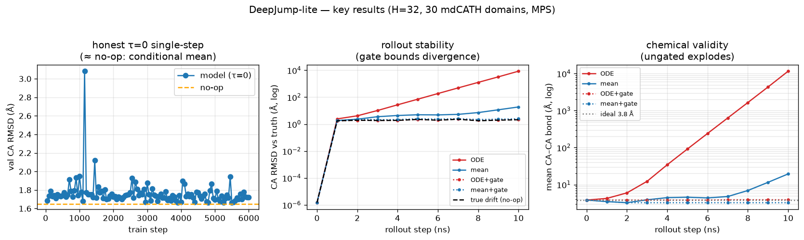
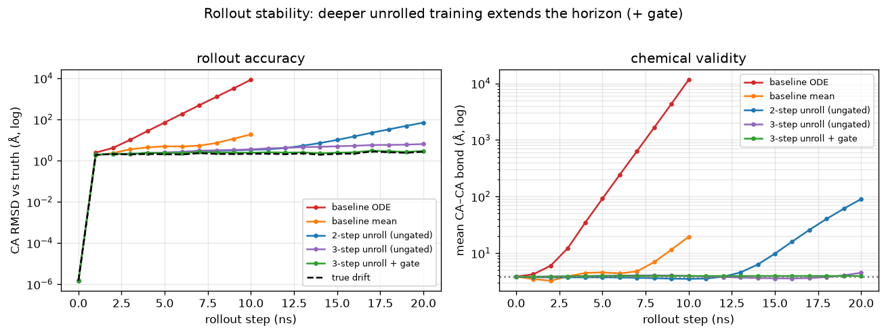
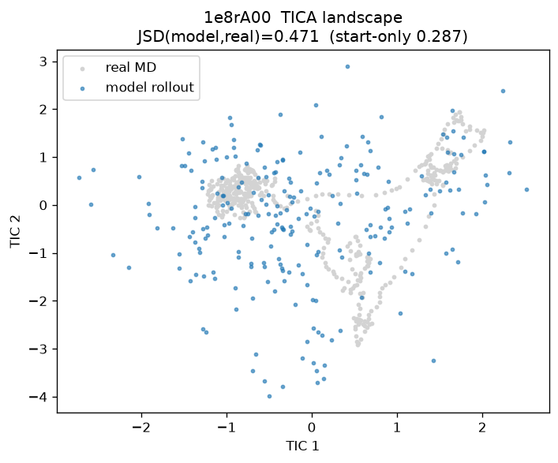

# DeepJump-lite — Reproduction Report

**Scope.** A from-scratch, plain-PyTorch reproduction of the *core trainable interface*
of DeepJump (arXiv:2509.13294) — the conditional conformational jump operator
`p(X_{t+δ} | X_t, sequence, δ)` — trained on the public mdCATH MD dataset and run
entirely on an Apple-Silicon laptop (MPS). This is **not** a full reproduction of the
paper's results (no official code, no fast-folder data); it rebuilds the method, the
data pipeline, the equivariant model, and an honest evaluation, with clearly marked
boundaries. Model: H=32 (~114k params), 30 mdCATH domains (24 train / 6 held-out val).







## 1. What was implemented

| Piece | Detail |
|---|---|
| Representation `X=(P,V)` | Cα coords + heavy-atom offsets (Ophiuchus canonical order), zero-padded, masked |
| Data | mdCATH HDF5 → aligned `(X_t, X_{t+δ})` pairs; **Kabsch-aligned** to remove rigid-body tumbling |
| Model | 2-stage SE(3)-equivariant transformer (conditioner + transport), GVP-style, hand-rolled (no e3nn) |
| Objective | AlphaFlow x₁ prediction; pairwise-vector Huber (Cα) + heavy-atom offset + **25 Å all-atom Vector-Map** loss |
| Stability | geometry acceptance gate; input-augmentation + **k-step unrolled (self-conditioning)** training |
| Sampling | Euler ODE + deterministic-mean modes; multi-step rollout |
| Eval | τ-sweep single-step, δ=1 vs δ=10, H=32 vs 64, rollout drift/geometry/contacts, **TICA distributional JSD** |
| Tests | rotation-equivariance (representation + full model incl. `V̂₁`), masking, shapes — **14/14** |

## 2. Key results (held-out val)

**Single-step CA RMSD vs latent time τ (Å):**

| query | δ=1 | δ=1 +heavy | δ=10 |
|---|---|---|---|
| no-op (`X̂=X_t`) | 1.58 | 1.58 | 2.25 |
| x̂₁ @ τ=0 | 1.65 | 1.67 | 2.28 |
| x̂₁ @ τ=0.5 | 0.52 | 0.54 | 0.64 |
| x̂₁ @ τ=0.9 | 0.42 | 0.42 | 0.53 |

Heavy-atom offset MAE follows the same curve (no-op 0.43 → τ=0.9 0.15 Å).

**Rollout stability (ungated, step-20 CA RMSD / bond, Å):** baseline mean 18.8 / 19.4 · 2-step
unroll 70 / 90 · **3-step unroll 6.4 / 4.5** · 3-step unroll+gate **2.9 / 3.9** (FNC 0.81).
Deeper unrolling extends the stable horizon; +gate holds it fully bounded.

**Capacity / loss:** H=64 beats H=32 at every τ (τ=0 1.67→1.58, τ=0.9 0.42→0.35, ODE 2.44→1.84);
the faithful 25 Å all-atom Vector-Map loss trains cleanly (ODE 2.44→1.96).

**Distributional (TICA):** JSD(model rollout, real) = **0.58** vs start-only 0.38 — the stable
rollout does *not* reproduce the equilibrium landscape (under-explores). See `docs/tica.png`.

## 3. Honest findings

1. **The model learns the transport field** — accuracy improves monotonically as the
   interpolant input approaches the target (τ 0→0.9: 1.65→0.42 Å).
2. **Single-step ≈ no-op is expected, not failure.** A deterministic x₁-MSE predictor
   approximates the conditional mean `E[X_{t+δ}|X_t] ≈ X_t` for diffusive 1 ns dynamics.
   Single-step RMSD vs no-op is therefore a weak metric; the honest query is τ=0 (random
   τ leaks the answer). DeepJump itself is judged distributionally, not by single-step RMSD.
3. **Naive rollout is unstable, and three fixes help** (see `docs/stability.png`). ODE explodes
   immediately; the mean predictor diverges after ~7 steps (distribution shift).
   (a) **Geometry acceptance gate** (Timewarp spirit) bounds it but at low acceptance — stable but
   conservative. (b) **Input-augmentation training** (noise the conditioner's `X_t`) makes the
   model intrinsically robust: ungated horizon ~15 steps (RMSD @10 18.8→4.5 Å), single-step
   improves. (c) **Unrolled / self-conditioning training** (`f(f(…f(X_t)))≈X_{t+kδ}`) is the real
   cure for the horizon — each extra step extends it: 2-step lasts ~13 steps ungated, **3-step stays
   bounded and physical over the full 20** (step-20 6.4 Å / bond 4.5 vs 2-step's 70 / 90); 3-step +
   gate holds it fully stable (2.9 Å, FNC 0.81). But distributionally (finding 4b) even the stable
   rollout under-explores — full closure needs deeper unrolling / energy MH / SDE / two-sided interpolant.
4. **Larger δ = bigger, harder jump** (no-op 1.58→2.25 for δ=1→10), but 10× time only
   moves ~1.4× as far — protein motion is bounded, which is why large-δ jumps accelerate MD.
5. **Distributional match improves with scale + stochastic sampling** (TICA conditional ensemble,
   same domain): H=64/30-dom/δ=1 JSD **0.58** (mean) → **0.42** (K stochastic ODE single-jumps, the
   DeepJump-native ensemble) → **0.39** (H=128/80-dom/multi-δ). The **deepest run so far**
   (`configs/faithful_scaled_v2.yaml`, H=128, **200 domains**, 60k steps, multi-δ) reaches
   **JSD 0.347** on held-out domain `1e8rA00` (its start-only floor is 0.287; `docs/tica_faithful.png`)
   — the closest-to-floor result yet. Not fully closed but monotonic as scale increases — the model
   goes from one-corner coverage to filling the real multi-basin landscape (`docs/tica_scaled.png`).
   **This answers "is it a scale problem?": largely yes** — the fix is the paper's recipe (bigger H,
   more domains, more steps), not architecture; we're at ~8% of the paper's training even now.
   **But more steps ≠ better on small data:** the same config at 60k steps (vs 40k) *regresses*
   (conditional TICA 0.347 → 0.545) — overfitting. The bottleneck has shifted from training *time*
   to data *diversity* (more domains, not more steps).
6. **Capacity helps** (H=64 beats H=32 at every τ; H=128 further); **25 Å all-atom Vector-Map loss**,
   **multi-scale δ (1/10/100)**, and **symmetric-sidechain canonicalization** all train cleanly —
   drop-in steps toward the full method.

## 4. Differences from the DeepJump paper

- **ODE-only, x₁-prediction** (AlphaFlow param); no SDE / two-sided stochastic interpolant
  (EquiJump) — deliberately simplified.
- **Hand-rolled GVP/EGNN-style equivariance**, not e3nn spherical-harmonic tensor products.
- **Scale**: H=32, 30 domains, MPS laptop (paper: H≤128, 5398 domains, 4×A6000, 500k steps).
- **Cα-pairwise loss** (all pairs) rather than the 25 Å all-atom cutoff (heavy-atom offset
  loss added; full all-atom pairwise is future work).

## 5. Distributional evaluation, and what is still out of scope

We *do* implement a lite **TICA distributional evaluation** (`scripts/tica_eval.py`): fit TICA on
a real trajectory's SE(3)-invariant Cα-pairwise features, project the model's rollout ensemble and
real MD into TIC space, compare via 2D-histogram JSD. Result: **JSD = 0.58 (model) vs 0.38
(start-only)** — even the stable gated rollout under-explores and does not reproduce the landscape.
This is the paper's evaluation *philosophy* at lite scale, with an honest negative result.

Still out of scope: the paper's **fast-folder headline numbers** (stationary JSD, folding ΔG,
MFPT, ab initio folding) need the DESRES fast-folder trajectories, unavailable here; full MSM
kinetics presume a stable, unbiased sampler we do not yet have (§3, finding 3).

## 6. Limitations / next steps

- **Close the distributional gap** (the main open item): the rollout is now geometrically stable
  (3-step unroll + gate) but does not sample the right ensemble (JSD 0.58). Deeper unrolling,
  energy-based MH acceptance, or an SDE / two-sided stochastic interpolant (EquiJump) are the paths.
- Symmetric-sidechain l=2 encoding; δ=100 ns; MSM kinetics / fast-folder metrics (need DESRES data).
- Done this round: 25 Å all-atom loss, H=64 sweep, k-step unrolled training, TICA eval,
  and the deepest scale run (H=128, 200 domains, multi-δ → conditional TICA JSD 0.347 on `1e8rA00`).

## 7. Reproduce

```bash
pip install -e .
python scripts/download_mdcath.py --n 30 --max-gb 0.55
python scripts/train.py --config configs/ca_delta1.yaml --max-steps 6000   # or full_delta1 / ca_delta10
python scripts/diagnose_tau.py  --ckpt runs/ca_delta1/last.ckpt            # τ-sweep vs no-op
python scripts/rollout_eval.py  --ckpt runs/full_delta1/last.ckpt --mode mean --gate
python scripts/plot_summary.py                                             # docs/summary.png
pytest -q                                                                  # 14/14
```
